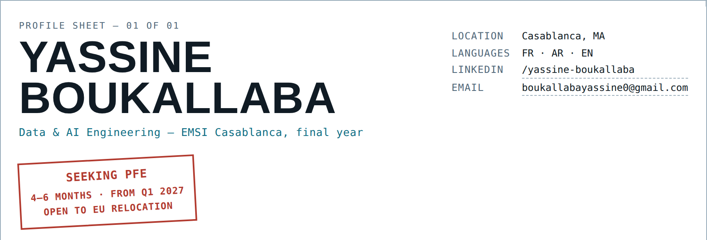

<picture>
  <source media="(prefers-color-scheme: dark)" srcset="assets/banner-dark.png">
  <source media="(prefers-color-scheme: light)" srcset="assets/banner-light.png">
  
</picture>

 

### 01 · Profile

Final-year engineering student specializing in AI & Data Management. I work where data engineering and applied AI meet — multi-agent systems, data pipelines, and models that end up inside something someone actually uses. I care about understanding every layer of what I ship, which is why my main build runs entirely offline, on a local model, with no cloud dependency.

Previously AI intern at [HPS](https://www.hps-worldwide.com/), a Moroccan fintech building card and electronic payment systems.

### 02 · Featured build — DARVIS

**Nine agents, one pipeline — autonomous data analysis, offline.** Upload a CSV, JSON or XLSX file and DARVIS runs the full analyst workflow — collect, profile, clean, engineer features, explore, recommend a model — streamed live, with a human checkpoint at every step that matters. Runs entirely on a local LLaMA 3.1 model through Ollama, switches from pandas to DuckDB past 500k rows, and grounds its model picks in a RAG index of 100 algorithms.

`BRAIN` → `COLLECT` → `LAKE` → `EXPLORE` → `CLEAN` → `FEATURES` → `EDA` → `ADVISE` → `REPORT`
 route · ingest · store · profile · fix · engineer · visualize · recommend · deliver

`LangGraph` `FastAPI` `Next.js 14` `DuckDB` `ChromaDB` `Ollama` `scikit-learn`

*Built with Mehdi Amine Bazguioui — end-of-year project (PFA).*

### 03 · Stack — bill of materials

*Qty = technologies listed under each heading of my own CV. Nothing here is a self-rating.*

| Item | Designation | Components | Qty |
|---|---|---|---|
| 01 | Languages | Python, Java, TypeScript, SQL, C/C++, PHP, C# | 09 |
| 02 | Python backend | FastAPI, Django, Flask, Streamlit | 04 |
| 03 | Data & ML | Pandas, NumPy, scikit-learn, SHAP, joblib | 09 |
| 04 | AI / LLM / agents | LangChain, LangGraph, Ollama, MCP | 05 |
| 05 | Big data libs | PyArrow, DuckDB, Kafka client, Great Expectations | 04 |
| 06 | Frontend | React, Next.js, Vite, Tailwind | 05 |
| 07 | Desktop | JavaFX, Swing | 02 |
| 08 | Relational DB | PostgreSQL, MySQL, Oracle, SQL Server | 05 |
| 09 | NoSQL DB | MongoDB, Neo4j, Redis, Cassandra | 04 |
| 10 | Vector / analytic DB | ChromaDB, DuckDB | 02 |
| 11 | Data engineering | Kafka, Spark, Hadoop, Airflow, MinIO | 08 |
| 12 | BI / DW | SSIS, data warehouse design | 02 |
| 13 | DevOps & cloud | Docker, Azure, AWS, IIS, Maven | 06 |
| 14 | Virtualization | ESXi, Proxmox, Hyper-V, VirtualBox | 04 |
| 15 | OS | Linux Debian, Red Hat | 02 |
| 16 | IoT | Arduino, MQTT | 02 |
| 17 | Protocols | REST, SSE, MCP, JWT, bcrypt | 05 |
| 18 | Design / modeling | UML, Merise, Astah | 03 |
| 19 | Tools | Git, Jupyter, IntelliJ, VS Code | 07 |

### 04 · Build timeline

| 2022 | 2024 | 2025 | 2026 | 2027 |
|---|---|---|---|---|
| CPI starts | 3IIR | 4IADM | HPS internship | PFE · graduation |

> Margin note — self-hosts what I can on hardware I own; rides when not at a terminal.

---

Drawn by Y. Boukallaba · Updated Sep 2026 · Sheet 1/1 · <a href="mailto:boukallabayassine0@gmail.com">email</a> · <a href="https://www.linkedin.com/in/yassine-boukallaba-369255337/">LinkedIn</a>
